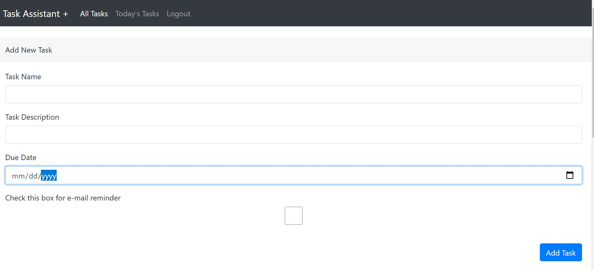
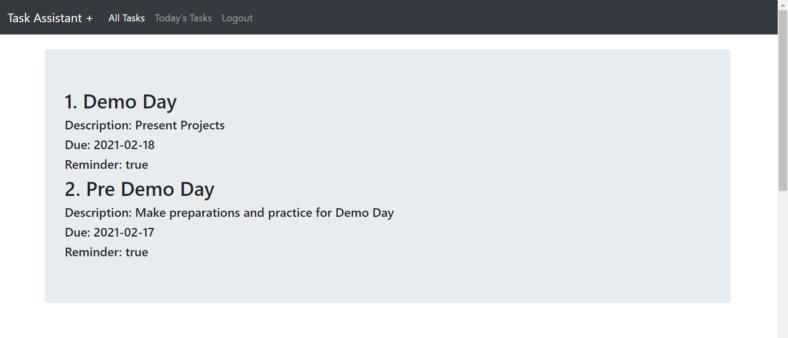
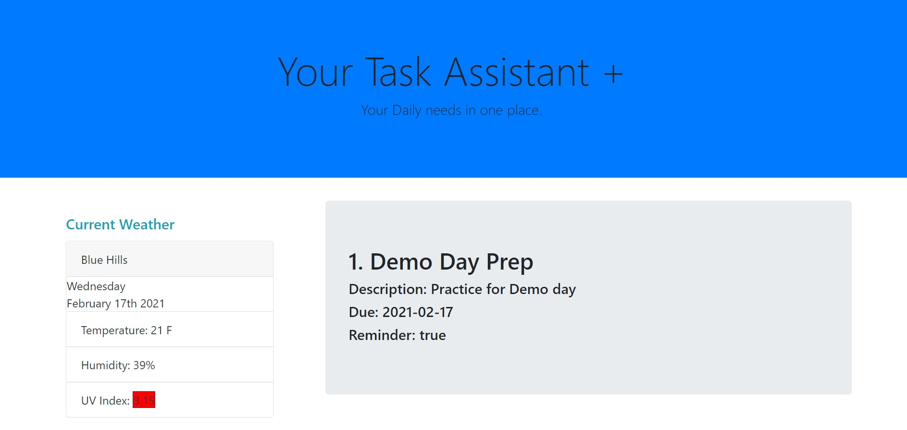

​
# Task Assistant +

​

​
## Heroku Deployed
https://bvproject2.herokuapp.com/ 
​
## Table of Contents
* [Description](#Description)
* [User Story](#UserStory)
* [Installation](#installation)
* [Usage](#Usage)
* [Screenshots](#Screenshots)
* [Credits](#credits)
* [Repository Link](#Repositories)
* [License](#license)
​
## Description
Task Assistant + is an easy to use application that helps users keep track of their daily tasks. Users can add taks and set reminders for various tasks. In line with daily activities the app also provides users with daily news from NY Times and also the weather conditions in theie current location.
​
## UserStory
AS A developer,  
I WANT a task management app,  
SO THAT can quickly create tasks to be completed and send myself email reminders  
​
​
​
## Installation
No installation needed 😎
​
## Usage
Used for creating, viewing and reminding oneself of tasks via email
Users are required to create an account with their email, password and first and last name
Users will then be able to create or view the tasks that need to be done and set reminders for themselves.
​
## Screenshots

​
​
​
## Credits
[Braenaan Vaughan](https://github.com/BraenaanV)
​
[Kwaku Asare Owusu](https://github.com/KwakuAsare)
​
[Matthew Pollicito](https://github.com/mpollicito)
​
## Repositories
- [Heroku Deployed Link](https://bvproject2.herokuapp.com/)
- [GitHub Repository](https://github.com/BraenaanV/Task-Assistant-Plus)
 
​
## License
MIT: <https://rem.mit-license.org>
​
### Badges
(https://img.shields.io/badge/license-[MIT]-blue.svg)
(https://img.shields.io/github/languages/top/nielsenjared/badmath)
​
---
© 2020 - Matthew Pollicito, Kwaku Asare Owusu, Braenaan Vaughan. All Rights Reserved.
